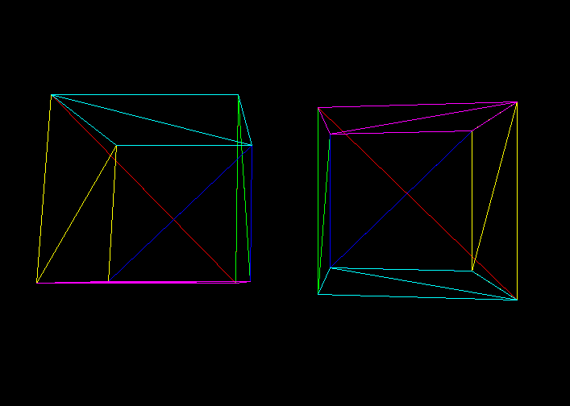

# Razer

A remake of my old Rasterizer with the same name.



## Table of Contents

- [Installation](#installation)
- [Building](#building)
- [Features](#features)

## Installation

```bash
    git clone --recursive https://github.com/no-good-names/Razer.git
    cd Razer
```

## Building

This project should be able to build on any platform with a C compiler and CMake.

### Prerequisites

- CMake
- Ninja (optional)

### Building With Make

```bash
    mkdir build
    cd build
    cmake ..
    make
```

### Building With Ninja

```bash
    mkdir build
    cd build
    cmake -G Ninja ..
    ninja
```

## Features

- [x] Basic Rasterization
- [x] Basic Transformations
- [ ] Texture Mapping
- [ ] Z-Buffering
- [ ] Anti-Aliasing
- [ ] Shading

## License

This project is licensed under the MIT License - see the [LICENSE](LICENSE) file for details.
